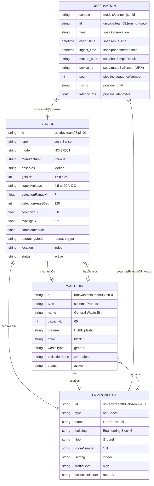

#From Raw Sensor Data to Structured Models

## Overview

This lab builds on the producer/consumer pipeline from Lab 04. Raw pipeline output such as the record below is opaque to anyone outside the project:

```json
{
  "event_time": "2026-04-10T14:32:01.123Z",
  "device_id": "pir-01",
  "event_type": "motion",
  "motion_state": "detected",
  "seq": 7,
  "run_id": "abc123",
  "ingest_time": "2026-04-10T14:32:01.130Z",
  "pipeline_latency_ms": 7.0
}
```

Questions a reader cannot answer from this record alone:

| Field | Ambiguity |
|---|---|
| `device_id: "pir-01"` | Is this a product code? A room label? An IP address? |
| `motion_state: "detected"` | Did something move, or did the sensor detect *absence* of motion? |
| `pipeline_latency_ms: 7.0` | Milliseconds? Microseconds? Is the name just a convention? |
| `event_time` vs `ingest_time` | Which is when motion occurred? Which is when the record was written? |

In this lab we solve this by modelling every entity in the system — the **sensor**, the **wastebin** it is mounted on, and the **environment** it is deployed in — as JSON-LD documents. The pipeline output is updated to carry `@id` references back to those models and a `@context` that maps every field name to a published, formally defined term.

The result is **self-describing data**: anyone who reads a pipeline record can follow the links and understand what device produced it, where it was deployed, what it is attached to, and what every value means.

---

## Repository Structure

```
/
├── docs/
│   └── ontology.md                  ← Custom term definitions (our namespace)
├── labs/
│   └── lab05/
│       ├── README.md                ← This file
│       ├── models/
│       │   ├── sensor.jsonld        ← HC-SR501 PIR sensor description
│       │   ├── wastebin.jsonld      ← Wastebin entity description
│       │   ├── environment.jsonld   ← Room / deployment space description
│       │   └── context.jsonld       ← Shared @context for pipeline events
│       ├── requirements.txt
│       ├── run_pipeline.py
│       └── pirlib/
│           ├── __init__.py
│           ├── sampler.py
│           └── interpreter.py
```

---

## Entity Diagram

The diagram below shows every entity the system models, the key properties of each, and the relationships between them. An **Observation** record — one line of JSONL pipeline output — sits at the centre and links outward to the sensor and the environment that contextualise it.



### Relationship summary

| From | Relationship | To |
|---|---|---|
| `sensor.jsonld` | `mountedOn` | `wastebin.jsonld` |
| `sensor.jsonld` | `deployedIn` | `environment.jsonld` |
| `wastebin.jsonld` | `hasSensor` | `sensor.jsonld` |
| `wastebin.jsonld` | `locatedIn` | `environment.jsonld` |
| `environment.jsonld` | `contains` | `wastebin.jsonld` |
| Pipeline observation | `sosa:madeBySensor` | `sensor.jsonld` |
| Pipeline observation | `sosa:hasFeatureOfInterest` | `environment.jsonld` |

---

## Data Models

### Sensor — `sensor.jsonld`

Describes the physical **HC-SR501 passive infrared sensor**. Every numeric value below is taken directly from the hardware wiring documented in Lab 04 and the defaults in `run_pipeline.py`.

| Property | Value | Source |
|---|---|---|
| GPIO pin (BCM) | 17 | Lab 04 wiring table |
| Physical pin | 11 | Raspberry Pi 40-pin header |
| Supply voltage | 4.5 – 20 V DC (fed from the 5 V rail, pin 2) | HC-SR501 datasheet |
| Detection range | up to 7 m | HC-SR501 datasheet |
| Detection angle | 120° | HC-SR501 datasheet |
| Sample interval | 0.1 s (10 Hz) | `--sample-interval` default in `run_pipeline.py` |
| Cooldown | 5.0 s | `--cooldown` default in `run_pipeline.py` |
| Minimum HIGH duration | 0.2 s | `--min-high` default in `run_pipeline.py` |
| Operating mode | repeat-trigger | HC-SR501 hardware jumper setting |

**What the sensor observes:**
`sosa:observes` points to `Motion` (a `sosa:ObservableProperty`). This is deliberate precision — the HC-SR501 detects *motion of warm bodies* (a momentary event), not continuous *presence* or an *occupancy count*, which are different observable properties with different semantics.

**Sensing principle:**
The HC-SR501 is a passive infrared device — it emits nothing. It detects changes in the infrared energy pattern across its two pyroelectric sensing elements. When a warm body moves through the field, the differential signal crosses an internal threshold and the OUT pin is pulled HIGH. This is why `motion_state: detected` means something *moved*, not that something is *stationary and present*.

**How cooldown and min-high relate to the model:**
`PirInterpreter` in `pirlib/interpreter.py` implements two software suppression rules:

- **`min_high_s` (0.2 s):** The signal must stay HIGH for at least 0.2 s before an event is emitted. This filters electrical noise and sub-threshold disturbances that briefly toggle the pin.
- **`cooldown_s` (5.0 s):** After emitting an event, no further event is emitted for 5 s even if the signal remains HIGH. This prevents a single continuous motion from flooding the queue.

Both are modelled as named properties of the sensor entity so that any consumer of an observation record can understand why the event rate is bounded as it is, without reading the source code.

**Vocabularies used:**

| Prefix | Namespace | Why |
|---|---|---|
| `sosa` | `http://www.w3.org/ns/sosa/` | `Sensor`, `ObservableProperty`, `madeBySensor`, `resultTime` |
| `ssn` | `http://www.w3.org/ns/ssn/` | `hasProperty`, `SystemCapability` |
| `schema` | `https://schema.org/` | `name`, `description`, `manufacturer` |
| `pipeline` | `…/docs/ontology.md#` | `gpioPin`, `cooldownS`, `minHighS`, `sampleIntervalS` |

---

### Wastebin — `wastebin.jsonld`

Describes the physical bin the sensor is mounted on. The model is designed to serve two audiences simultaneously:

- A **waste collection service** needs: `capacityL`, `wasteType`, `collectionZone`, `status`.
- A **campus management system** needs: `locatedIn`, `hasSensor`, `status`.

**`hasSensor` is an array** even though only one PIR sensor exists today. When a fill-level ultrasonic sensor is added in a future lab, the model requires no schema change — a new URN is simply appended to the array. This is a deliberate forward-compatibility decision.

**`locatedIn`** is a resolvable URN, not a plain-text string like `"Room 101"`. Any system processing this record can dereference the URN and retrieve the full room description, including building, floor, and collection route.

**Vocabularies used:**

| Prefix | Namespace | Why |
|---|---|---|
| `schema` | `https://schema.org/` | `Product`, `name`, `description`, `material` |
| `sosa` | `http://www.w3.org/ns/sosa/` | `hosts` (links a sensor to its hosting platform) |
| `pipeline` | `…/docs/ontology.md#` | `capacityL`, `wasteType`, `collectionZone` |

---

### Environment — `environment.jsonld`

Describes the physical space in which the wastebin is deployed. The spatial hierarchy is modelled explicitly as named properties — **campus → building → floor → room** — rather than as free-text, so a query can answer *"show all sensors on the ground floor of Engineering Block B"* without any string parsing.

**`contains`** lists the wastebin `@id`, completing the bidirectional graph also expressed in `wastebin.jsonld → locatedIn` and `sensor.jsonld → deployedIn`. Any entity in the graph can serve as an entry point to navigate to any other.

**`trafficLevel` and `collectionRoute`** are custom `pipeline:` terms because no standard vocabulary covers operational waste-collection routing. Both are documented in `docs/ontology.md`.

**Vocabularies used:**

| Prefix | Namespace | Why |
|---|---|---|
| `bot` | `https://w3id.org/bot#` | `Space`, `Zone` — purpose-built for building topology |
| `schema` | `https://schema.org/` | `Place`, `name`, `description` |
| `pipeline` | `…/docs/ontology.md#` | `trafficLevel`, `collectionRoute` |

---

## Semantic Context — `context.jsonld`

Every field produced by `run_pipeline.py` is mapped to a formally defined term. The fields come directly from the `record` dict built in `producer_loop` and enriched in `consumer_loop`:

```python
# producer_loop — run_pipeline.py
record = {
    "event_time":   utc_now_iso(),   # wall-clock time the producer created the record
    "device_id":    args.device_id,  # logical sensor name (rewritten as URN in Lab 05)
    "event_type":   "motion",
    "motion_state": "detected",
    "seq":          seq,             # per-run counter, starts at 1
    "run_id":       run_id,          # UUID, fresh each pipeline start
}

# consumer_loop enrichment
record["ingest_time"]         = ingest_ts      # wall-clock time consumer wrote the record
record["pipeline_latency_ms"] = round(latency, 3)
```

Full mapping:

| Pipeline field | Mapped to | Datatype | Standard? | Notes |
|---|---|---|---|---|
| `event_time` | `sosa:resultTime` | `xsd:dateTime` | ✅ SOSA | Time the motion event was detected and the record created by the producer |
| `ingest_time` | `sosa:phenomenonTime` | `xsd:dateTime` | ✅ SOSA | Time the consumer dequeued and persisted the record |
| `device_id` | `sosa:madeBySensor` | `@id` | ✅ SOSA | Rewritten as `urn:dev:team08:pir-01` so the value is a resolvable URN, not an opaque string |
| `event_type` | `@type` | — | ✅ JSON-LD | Always `"motion"`; maps to `sosa:Observation` at the record level |
| `motion_state` | `sosa:hasSimpleResult` | `xsd:string` | ✅ SOSA | Always `"detected"` (event only fires on rising edge after cooldown) |
| `seq` | `pipeline:sequenceNumber` | `xsd:integer` | 🔶 Custom | Monotonically increasing per `run_id`; resets each pipeline start |
| `run_id` | `pipeline:runId` | `xsd:string` | 🔶 Custom | UUID generated once per `main()` call; groups records from the same run |
| `pipeline_latency_ms` | `pipeline:latencyMs` | `xsd:float` | 🔶 Custom | `(ingest_time − event_time) × 1000`; measures queue residence time |

> **Why `sosa:resultTime` for `event_time` and `sosa:phenomenonTime` for `ingest_time`?**
>
> SOSA defines `resultTime` as *the time when the result of an Observation was generated* — i.e. when the sensor fired and the producer created the record. It defines `phenomenonTime` as *the time the Observation result applies to the feature of interest* — i.e. when the observation became a durable fact by being written to disk. This is not a naïve name match: it reflects the actual semantics of what each timestamp records in this pipeline.

---

## Custom Ontology Namespace

Terms with no standard equivalent are defined under the project namespace:

```
https://github.com/team-no8/lab-5-pie/blob/main/docs/ontology.md#
```

Prefix in JSON-LD: `pipeline`

The file `docs/ontology.md` documents every custom term with its datatype, description, and rationale. Once pushed to GitHub, each URL below resolves to the relevant anchor:

| Term | Resolving URL |
|---|---|
| `pipeline:sequenceNumber` | `…/ontology.md#sequenceNumber` |
| `pipeline:runId` | `…/ontology.md#runId` |
| `pipeline:latencyMs` | `…/ontology.md#latencyMs` |
| `pipeline:gpioPin` | `…/ontology.md#gpioPin` |
| `pipeline:cooldownS` | `…/ontology.md#cooldownS` |
| `pipeline:minHighS` | `…/ontology.md#minHighS` |
| `pipeline:sampleIntervalS` | `…/ontology.md#sampleIntervalS` |
| `pipeline:trafficLevel` | `…/ontology.md#trafficLevel` |
| `pipeline:collectionRoute` | `…/ontology.md#collectionRoute` |
| `pipeline:capacityL` | `…/ontology.md#capacityL` |
| `pipeline:wasteType` | `…/ontology.md#wasteType` |
| `pipeline:collectionZone` | `…/ontology.md#collectionZone` |

This is not just a naming convention — it is live documentation that any reader with repository access can follow directly from any observation record.

---

## Pipeline Output Format

A pipeline event after the Lab 05 changes:

```json
{
  "@context": "models/context.jsonld",
  "@id": "urn:obs:team08:3f2a1b4c-9e12-4d87-b031-abc123def456:7",
  "@type": "sosa:Observation",
  "event_time": "2026-04-10T14:32:01.123Z",
  "device_id": "urn:dev:team08:pir-01",
  "motion_state": "detected",
  "seq": 7,
  "run_id": "3f2a1b4c-9e12-4d87-b031-abc123def456",
  "ingest_time": "2026-04-10T14:32:01.130Z",
  "pipeline_latency_ms": 7.0,
  "sosa:hasFeatureOfInterest": "urn:env:team08:lab-room-101"
}
```

Comparison against Lab 04 output:

| Field | Lab 04 | Lab 05 |
|---|---|---|
| `@context` | absent | `"models/context.jsonld"` |
| `@id` | absent | `urn:obs:team08:{run_id}:{seq}` |
| `@type` | absent | `"sosa:Observation"` |
| `device_id` | `"pir-01"` (opaque string) | `"urn:dev:team08:pir-01"` (resolvable URN) |
| `event_type` | `"motion"` (plain string) | removed — expressed by `@type` |
| `sosa:hasFeatureOfInterest` | absent | `"urn:env:team08:lab-room-101"` |

---

## Design Decisions & Trade-offs

### How to embed `@context` in a streaming JSONL pipeline

The consumer writes one JSON object per line via `f.write(json.dumps(record) + "\n")`. Three strategies exist:

| Strategy | Pros | Cons | Chosen? |
|---|---|---|---|
| **Inline the full context in every record** | Fully self-contained; every line parseable without external files | Massive redundancy — the context object is repeated for every event, inflating file size significantly | ✗ |
| **Reference by relative file path** `"@context": "models/context.jsonld"` | Compact records; single source of truth; updating the context does not touch any record | Consumer must have the context file at that relative path; breaks if records are transmitted without the file | ✅ Our choice |
| **Context declared once at the top of the file** | No external file; compact body lines | Not valid JSONL — lines are not independent JSON objects; breaks line-by-line streaming parsers | ✗ |

We chose the **file-reference approach** because all consumers in this project run in the same directory as the model files. For external consumers, the reference would be updated to the absolute raw GitHub URL so the context is accessible without cloning the repository.

### URN scheme

All entity identifiers follow:

```
urn:{entity-type}:team08:{local-name}
```

Observation records use a composite ID combining the `run_id` UUID (generated once in `main()`) and the `seq` counter (incremented in `producer_loop`):

```
urn:obs:team08:{run_id}:{seq}
```

This makes every observation globally unique and sortable by run and sequence. Because the output file is opened in **append mode** (`open(out_path, "a", ...)`) across multiple pipeline runs, two observations can share the same `seq` value — the `run_id` distinguishes them.

### Drop-newest queue policy

`producer_loop` uses `put_nowait()` and catches `queue.Full` to drop the newest record when backpressure occurs. The `metrics["dropped"]` counter tracks losses. This means the output JSONL may have gaps in `seq` numbers under load, which is why `seq` is modelled as `pipeline:sequenceNumber` (a counter) rather than a line index.

---

## Vocabulary Choices — Justification

| Vocabulary | Why we used it | Why not the alternative |
|---|---|---|
| **SOSA/SSN** | Purpose-built for sensors and observations. `Sensor`, `Observation`, `ObservableProperty`, `madeBySensor`, `resultTime`, `phenomenonTime`, and `hasSimpleResult` all map directly onto what `run_pipeline.py` produces. | Schema.org has no sensor-specific terms. SAREF is richer but adds significant complexity for this scope. |
| **Schema.org** | `name`, `description`, `manufacturer`, `Product` cover general metadata cleanly without inventing custom terms. | Using only SOSA/SSN would require us to invent terms for things Schema.org already defines and indexes. |
| **BOT (Building Topology Ontology)** | `bot:Space` correctly represents a room with physical boundaries inside a building hierarchy. Designed for exactly this use case. | `schema:Place` is too broad — it does not distinguish a room from a continent. |
| **XSD datatypes** | `"7.0"` is unambiguously an `xsd:float`, not a string. Timestamps are `xsd:dateTime` (UTC, ISO 8601), removing timezone guessing. | Without explicit types, consumers must infer and different implementations disagree. |
| **Custom `pipeline:` namespace** | `seq`, `run_id`, and `pipeline_latency_ms` are internal pipeline concepts. No standard vocabulary covers them. Documenting them in `docs/ontology.md` gives them real, resolvable semantics. | Mapping them to approximate standard terms (e.g. `schema:position` for `seq`) would be semantically misleading. |

---

## How to Run

### Hardware wiring

| Sensor pin | Pi physical pin | Pi BCM name | Purpose |
|---|---|---|---|
| `VCC` | 2 | 5 V | Power |
| `GND` | 6 | GND | Reference |
| `OUT` | 11 | GPIO 17 | Signal input |

### Install dependencies

```bash
cd labs/lab05
pip install -r requirements.txt
```

### Run the pipeline

```bash
python run_pipeline.py \
  --device-id pir-01 \
  --pin 17 \
  --sample-interval 0.1 \
  --cooldown 5.0 \
  --min-high 0.2 \
  --duration 60 \
  --out motion_pipeline.jsonl \
  --verbose
```

### Parameter reference

| Parameter | Type | Default | Description |
|---|---|---|---|
| `--device-id` | str | `pir-01` | Logical sensor name embedded in every record |
| `--pin` | int | `18` | BCM GPIO pin number |
| `--sample-interval` | float | `0.1` | Seconds between reads (0.1 s = 10 Hz) |
| `--cooldown` | float | `5.0` | Min seconds between emitted events |
| `--min-high` | float | `0.2` | Min seconds signal must stay HIGH before emitting |
| `--queue-size` | int | `100` | Max records the bounded queue can hold |
| `--consumer-delay` | float | `0.0` | Artificial per-record delay in the consumer |
| `--duration` | float | `60.0` | Total run time in seconds (0 = run until Ctrl-C) |
| `--out` | str | `motion_pipeline.jsonl` | Output file path (append mode) |
| `--verbose` / `-v` | flag | off | Print status to stdout every second |

### Validate the JSON-LD model files

```bash
pip install PyLD
python - <<'EOF'
from pyld import jsonld
import json

for model in ["sensor", "wastebin", "environment"]:
    with open(f"models/{model}.jsonld") as f:
        doc = json.load(f)
    expanded = jsonld.expand(doc)
    print(f"=== {model}.jsonld ===")
    print(json.dumps(expanded, indent=2))
EOF
```

### Docker Compose

```bash
# Build and run
docker compose up --build

# Run in background
docker compose up --build -d

# View logs
docker compose logs -f motion-pipeline

# Stop
docker compose down
```

Output is written to `./output/motion_pipeline.jsonl` via the bind-mount volume.

---

# Part B 

**RQ1: Which vocabularies/ontologies did you use across your models? Why did you choose them over alternatives?**

**RQ2: What properties did you include in your sensor description? Which ones came from standard vocabularies and which ones did you define yourself?**

**RQ3: What properties did you include in your wastebin description? How did you decide what to include and what to leave out?**

**RQ4: How did you model the relationships between sensor, wastebin, and environment? Show the relevant @id references from each JSON-LD file.**

**RQ5: Were there properties you wanted to include but could not find a standard term for? How did you handle them?**

**RQ6: Show your complete @context and explain each mapping. For each field, why did you choose that particular standard term (or why did you define a custom one)?**

**RQ7: How did you define your custom namespace? What URL did you use and why?**

**RQ8: Take one field from your old pipeline output (e.g., event_time). What did it mean before? What does it mean now that it is mapped to a standard term? What is the practical difference?**

**RQ9: What is the role of @context in JSON-LD? What happens if you remove it is the JSON still valid? Is it still self-describing?**

**RQ10: How did you handle the @context in your streaming JSONL pipeline, inline, external reference, or something else? What are the trade-offs of your choice?**

**RQ11: Include your entity-relationship diagram in the report. Explain the diagram briefly, what are the entities, what are the key relationships, and how does an observation connect to the rest of the model?**

**RQ12: Another team uses a different motion sensor (e.g., microwave radar instead of PIR) but follows the same JSON-LD context. Could a downstream application process both teams’ data without modification? Why or why not?**

**RQ13: You need to add an ultrasonic distance sensor to measure bin fill level. What new JSON-LD files would you create? What would you change in existing files? What would stay the same?**

**RQ14: What properties are missing from your models that a real-world deployment would need? Name at least three and explain why they matter.**

**RQ15: Look at one domain-specific data model repository (e.g., SAREF, Smart Data Models, SSN). Find a model related to waste management, sensors, or smart buildings. How does it compare to what you built?**

**RQ16: In the DIKW pyramid from the lecture, where does your raw Lab 03 JSONL output sit? Where does the JSON-LD version sit? What moved it up the pyramid?**

**RQ17: In your own words, what is the difference between data that works and data that communicates information?**

**RQ18: If you had to explain to a non-technical person why your pipeline now produces “better” data, what would you say?**

