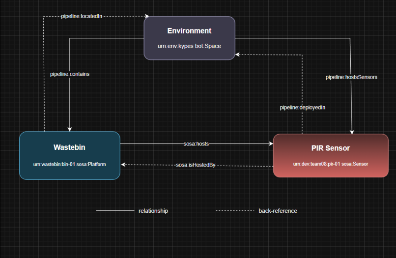

## How to Run

### Hardware wiring

| Sensor pin | Pi physical pin | Pi BCM name | Purpose |
|---|---|---|---|
| `VCC` | 2 | 5 V | Power |
| `GND` | 6 | GND | Reference |
| `OUT` | 11 | GPIO 17 | Signal input |

### Install dependencies

```bash
cd labs/lab05
pip install -r requirements.txt
```

### Run the pipeline

```bash
python run_pipeline.py \
  --device-id pir-01 \
  --pin 17 \
  --sample-interval 0.1 \
  --cooldown 5.0 \
  --min-high 0.2 \
  --duration 60 \
  --out motion_pipeline.jsonl \
  --verbose
```

### Parameter reference

| Parameter | Type | Default | Description |
|---|---|---|---|
| `--device-id` | str | `pir-01` | Logical sensor name embedded in every record |
| `--pin` | int | `17` | BCM GPIO pin number |
| `--sample-interval` | float | `0.1` | Seconds between reads (0.1 s = 10 Hz) |
| `--cooldown` | float | `5.0` | Min seconds between emitted events |
| `--min-high` | float | `0.2` | Min seconds signal must stay HIGH before emitting |
| `--queue-size` | int | `100` | Max records the bounded queue can hold |
| `--consumer-delay` | float | `0.0` | Artificial per-record delay in the consumer |
| `--duration` | float | `60.0` | Total run time in seconds (0 = run until Ctrl-C) |
| `--out` | str | `motion_pipeline.jsonl` | Output file path (append mode) |
| `--verbose` / `-v` | flag | off | Print status to stdout every second |


---
## Pipeline Output Format

A pipeline event after the Lab 05 changes:

```json
{
  "@context": {
    "@vocab": "https://schema.org/",
    "sosa": "http://www.w3.org/ns/sosa/",
    "ssn": "http://www.w3.org/ns/ssn/",
    "xsd": "http://www.w3.org/2001/XMLSchema#",
    "pipeline": "https://github.com/manosmax/Pie/blob/main/docs/Ontology#",
    "event_time": {
      "@id": "sosa:resultTime",
      "@type": "xsd:dateTime"
    },
    "ingest_time": {
      "@id": "pipeline:ingestTime",
      "@type": "xsd:dateTime"
    },
    "device_id": {
      "@id": "sosa:madeBySensor",
      "@type": "@id"
    },
    "mounted_on": {
      "@id": "sosa:isHostedBy",
      "@type": "@id"
    },
    "event_type": {
      "@id": "sosa:observedProperty",
      "@type": "@id"
    },
    "motion_state": {
      "@id": "sosa:hasSimpleResult",
      "@type": "xsd:string"
    },
    "seq": {
      "@id": "pipeline:sequenceNumber",
      "@type": "xsd:integer"
    },
    "run_id": {
      "@id": "pipeline:runId",
      "@type": "xsd:string"
    },
    "pipeline_latency_ms": {
      "@id": "pipeline:latencyMs",
      "@type": "xsd:decimal"
    }
  },
  "@id": "urn:event:383f7d25-1535-4e05-b8da-90d02daf3601:1",
  "@type": "sosa:Observation",
  "event_time": "2026-04-06T15:23:05.131Z",
  "device_id": "urn:dev:team08:pir-01",
  "event_type": "urn:prop:team08:motion",
  "motion_state": "detected",
  "seq": 1,
  "run_id": "383f7d25-1535-4e05-b8da-90d02daf3601",
  "mounted_on": "urn:wastebin:bin-01",
  "ingest_time": "2026-04-06T15:23:05.131Z",
  "pipeline_latency_ms": 0.0
}
```

## Repository Structure

```
/
├── docs/
│   └── ontology.md                  ← Custom term definitions (our namespace)
├── labs/
│   └── lab05/
│       ├── README.md                ← This file
│       ├── models/
│       │   ├── sensor.jsonld        ← HC-SR501 PIR sensor description
│       │   ├── wastebin.jsonld      ← Wastebin entity description
│       │   ├── environment.jsonld   ← Room / deployment space description
│       │   └── context.jsonld       ← Shared @context for pipeline events
│       ├── requirements.txt
│       ├── run_pipeline.py
│       └── pirlib/
│           ├── __init__.py
│           ├── sampler.py
│           └── interpreter.py
```


## Overview

This lab builds on the producer/consumer pipeline from Lab 04. Raw pipeline output such as the record below is not specific. Thus jsonld models are used in order to make every field accurately determined. We solve this by modelling every entity in the system — the **sensor**, the **wastebin** it is mounted on, and the **environment** it is deployed in — as JSON-LD documents.

**Vocabularies used:**

| Prefix | Namespace | Why |
|---|---|---|
| `sosa` | `http://www.w3.org/ns/sosa/` | `Sensor`, `ObservableProperty`, `madeBySensor`, `resultTime` |
| `ssn` | `http://www.w3.org/ns/ssn/` | `hasProperty`, `SystemCapability` |
| `schema` | `https://schema.org/` | `name`, `description`, `manufacturer` |
| `pipeline` | `…/docs/ontology.md#` | `gpioPin`, `cooldownS`, `minHighS`, `sampleIntervalS` |

---

## Entity Diagram

```
Diagram
    ### MODELS

SENSOR {
        string  id                  "urn:dev:team08:pir-01"
        string  type                "sosa:Sensor"
        string  model               "HC-SR501"
        string  observes            "Motiion"
        int     gpioPin             "17"
        int     physicalPin         "11"
        float   sampleIntervalS     "0.1"
        float   cooldownS           "5.0"
        float   minHighS            "0.2"
        string  operatingMode       "repeat-trigger"
        string  status              "active"
    }

    WASTEBIN {
        string  id              "urn:wastebin:bin-01"
        string  type            "sosa:Platform"
        string  name            "Wastebin 01"
        string  material        "plastic"
        string  color           "grey"
        int     heightCm        "18"
        int     diameterCm      "8"
        string  wasteType       "general"
        string  status          "active"
    }

    ENVIRONMENT {
        string  id              "urn:env:kypes"
        string  type            "bot:Space"
        string  name            "Kypes Lab"
        string  building        "basiko"
        string  roomNumber      "02"
        string  trafficLevel    "high"
        string  setting         "indoor"
    }    
    
    ### Relationship summary

    SENSOR      ||--|| WASTEBIN     : "sosa:isHostedBy"
    SENSOR      ||--|| ENVIRONMENT  : "pipeline:deployedIn"
    WASTEBIN    ||--|| ENVIRONMENT  : "pipeline:locatedIn"
    WASTEBIN    ||--|| SENSOR       : "sosa:hosts" 
    ENVIRONMENT ||--|| WASTEBIN     : "pipeline:contains"
    ENVIRONMENT ||--|| SENSOR       : "pipeline:hostsSensors"

``` 


## Custom Ontology Namespace

```
https://github.com/manosmax/Pie/blob/main/docs/Ontology#
```


---

# Part B 

**RQ1: Which vocabularies/ontologies did you use across your models? Why did you choose them over alternatives?**

We used SOSA and SSN for sensor and observation semantics, BOT for building/room topology, and XSD for datatype declarations. We also used our own pipeline: namespace covers system-internal concepts no standard vocabulary addresses.

**RQ2: What properties did you include in your sensor description? Which ones came from standard vocabularies and which ones did you define yourself?**

We defined on our own some of the properties like minHighS, gpioPin, cooldownS, sampleIntervalS, operatingMode,status . The most important are the following : 

```
string  id                  "urn:dev:team08:pir-01"
string  type                "sosa:Sensor"
string  model               "HC-SR501"
string  observes            "Motiion"
int     gpioPin             "17"
int     physicalPin         "11"
float   sampleIntervalS     "0.1"
float   cooldownS           "5.0"
float   minHighS            "0.2"
string  operatingMode       "repeat-trigger"
string  status              "active"
```

**RQ3: What properties did you include in your wastebin description? How did you decide what to include and what to leave out?**

In the wastebin, we included the wastebin's material, color, diameter, height and wastetype that help someone identify the bin in real life and calculate it's capacity. Further information would be redundant. 

**RQ4: How did you model the relationships between sensor, wastebin, and environment? Show the relevant @id references from each JSON-LD file.**

The sensor is hosted by the wastebin and deployed in the kypes environment. The wastebin in turn, hosts the sensor and is located in the kypes environment. Finally the kypes environment, contains the wastebin and hosts the sensor. We can see that all the relationships are bidirectional. 
- id_env : urn:env:kypes
- id_sensor : urn:dev:team08:pir-01
- id_wastebin : urn:wastebin:bin-01


**RQ5: Were there properties you wanted to include but could not find a standard term for? How did you handle them?**

Yes, we created our own ontology to define properties we couldn't find standard terms for such as sequenceNumber, counter and runid. 


**RQ6: Show your complete @context and explain each mapping. For each field, why did you choose that particular standard term (or why did you define a custom one)?**

```jsonld
{
  "@context": {
    "@vocab":   "https://schema.org/",
    "sosa":     "http://www.w3.org/ns/sosa/",
    "ssn":      "http://www.w3.org/ns/ssn/",
    "xsd":      "http://www.w3.org/2001/XMLSchema#",
    "pipeline": "https://github.com/manosmax/Pie/blob/main/docs/ontology.md#",

    "event_time": {
      "@id":   "sosa:resultTime",
      "@type": "xsd:dateTime"
    },

    "ingest_time": {
      "@id":   "pipeline:ingestTime",
      "@type": "xsd:dateTime"
    },

    "device_id": {
      "@id":   "sosa:madeBySensor",
      "@type": "@id"
    },

    "mounted_on": {
      "@id":   "sosa:isHostedBy",
      "@type": "@id"
    },

    "event_type": {
      "@id":   "sosa:observedProperty",
      "@type": "@id"
    },

    "motion_state": {
      "@id":   "sosa:hasSimpleResult",
      "@type": "xsd:string"
    },

    "seq": {
      "@id":   "pipeline:sequenceNumber",
      "@type": "xsd:integer"
    },

    "run_id": {
      "@id":   "pipeline:runId",
      "@type": "xsd:string"
    },

    "pipeline_latency_ms": {
      "@id":   "pipeline:latencyMs",
      "@type": "xsd:decimal"
    }
  }
}

```
1. @vocab: schema.org — default namespace for any unmapped term, so bare fields like name resolve to schema:name automatically.
sosa/ssn/xsd — standard W3C prefixes for sensor semantics and XML datatypes.

2. pipeline: — our custom namespace pointing to /blob/main/docs/ontology.md# in our repo; terms without a standard equivalent live here.

3. event_time → sosa:resultTime — the standard term for when the observation result was produced by the sensor.

4. ingest_time → pipeline:ingestTime — no standard term exists for "time the consumer received the message".

5. device_id → sosa:madeBySensor — formally links the observation to the sensor entity.

6. mounted_on → sosa:isHostedBy — standard SOSA term expressing which platform the wastebin hosts the sensor.

7. event_type → sosa:observedProperty — identifies the motion phenomenon being observed.

8. motion_state → sosa:hasSimpleResult — carries the actual observation value ("detected" / "clear").

9. seq → pipeline:sequenceNumber — pipeline-internal counter with no SOSA equivalent.

10. run_id → pipeline:runId — identifies which pipeline execution session produced the record; custom term.

11. pipeline_latency_ms → pipeline:latencyMs — time between event creation and consumer ingestion.

**RQ7: How did you define your custom namespace? What URL did you use and why?**

https://github.com/manosmax/Pie/blob/main/docs/ontology.md#

The URL used is easy to find and closely associated with the rest of our project. The # means each term becomes a URL fragment. This turns the namespace into real, living documentation rather than just a naming convention.

**RQ8: Take one field from your old pipeline output (e.g., event_time). What did it mean before? What does it mean now that it is mapped to a standard term? What is the practical difference?**

Before event_type, had a value of motion. This is arbitrary and even we weren't really sure of what this meant. Now sosa defines it specificaly as an observed property, an instantaneous motion (temperature > ambient) within the sensor field of view.
```
    "event_type": {
      "@id": "sosa:observedProperty",
      "@type": "@id"
    },
```


**RQ9: What is the role of @context in JSON-LD? What happens if you remove it is the JSON still valid? Is it still self-describing?**

@context maps local field names to globally unambiguous URIs. Without it, the JSON is still syntactically valid, but no longer self-describing.


**RQ10: How did you handle the @context in your streaming JSONL pipeline, inline, external reference, or something else? What are the trade-offs of your choice?**

We chose an inline approach. We print it whole with each record. It is visible easily by the viewer but results in longer records. 

**RQ11: Include your entity-relationship diagram in the report. Explain the diagram briefly, what are the entities, what are the key relationships, and how does an observation connect to the rest of the model?**

The sensor is hosted by the wastebin and deployed in the kypes environment. The wastebin in turn, hosts the sensor and is located in the kypes environment. Finally the kypes environment, contains the wastebin and hosts the sensor. We can see that all the relationships are bidirectional. 

The observation connects to the model via the id's of the entities. Specifically, the   "device_id": "urn:dev:team08:pir-01" is listed, and every field is linked through the context file with the vocabularies.




**RQ12: Another team uses a different motion sensor (e.g., microwave radar instead of PIR) but follows the same JSON-LD context. Could a downstream application process both teams’ data without modification? Why or why not?**

If the other team used a downstream application consuming events by context terms, not hardcoded field names, would process both pipelines identically. The sensor model files differ, but the observation record structure is shared. So the answer is yes, if they follow the same JSON-LD context.

**RQ13: You need to add an ultrasonic distance sensor to measure bin fill level. What new JSON-LD files would you create? What would you change in existing files? What would stay the same?**

We would create a new model for the sensor with its own attributes like @id, sosa:observes etc. We would also need to modify the wastebin.jsonld and context.jsonld to include the URN alongside the PIR.

**RQ14: What properties are missing from your models that a real-world deployment would need? Name at least three and explain why they matter.**

If we were to deploy the sensor in a real-life environment. We would need to include the battery level of the sensor and it's firmware version.

**RQ15: Look at one domain-specific data model repository (e.g., SAREF, Smart Data Models, SSN). Find a model related to waste management, sensors, or smart buildings. How does it compare to what you built?**

On the Smart Data Models we can find the WasteContainer model. While our model focuses on deployment and electronics, the former specializes in logistics and analysis. 

link : https://github.com/smart-data-models/dataModel.WasteManagement/blob/master/WasteContainer/README.md 

Our costum namespace adds more infrastructure terms that the existing domain model omits.

**RQ16: In the DIKW pyramid from the lecture, where does your raw Lab 03 JSONL output sit? Where does the JSON-LD version sit? What moved it up the pyramid?**

In Lab 03 we had Data which we processed and it became information. Now we also have knowledge because of our models which have created an infrastructure, giving meaning that is embedded in our project, not our teams memory.

**RQ17: In your own words, what is the difference between data that works and data that communicates information?**

Data can work even if it is only understood by the system or person that produces it. However if a different developer or system needs to proces the data there will be compatibility issues with what each value or measurement means. Data that communicates information can work for different systems because it carries knowledge that makes it legible by everyone.

**RQ18: If you had to explain to a non-technical person why your pipeline now produces “better” data, what would you say?**

We would explain to a non-technical person that our data used to only be managable by our team. Now the data we collect are more legible by other systems or by the community making it available for wider usage.

