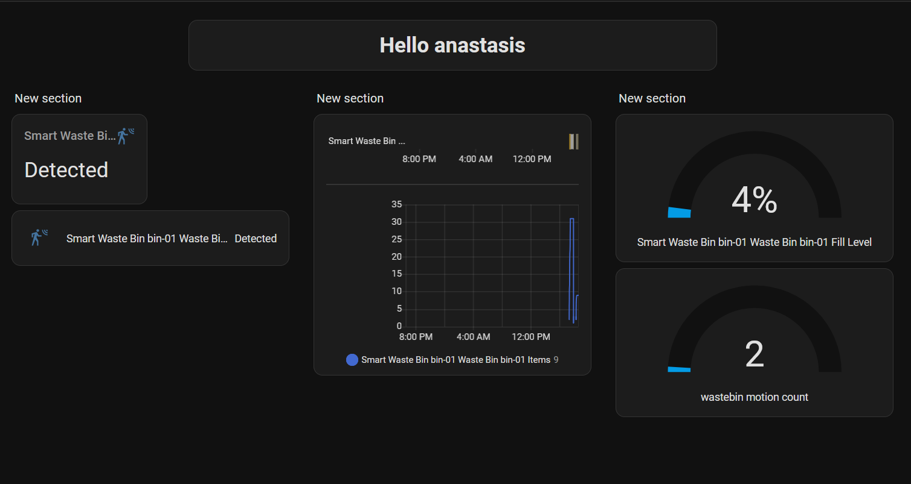

# Lab 07 — Smart Bin & Home Assistant

**Student:** anastasis | 12345678

---

## Part A — Setup & Run

### Wiring (Raspberry Pi)

| Sensor Pin | Pi Physical Pin | BCM Name |
|------------|-----------------|----------|
| `VCC`      | 2               | 5V       |
| `GND`      | 6               | GND      |
| `OUT`      | 11              | GPIO17   |

### Build

```bash
docker compose build
```

### Run

**1. Start the MQTT broker:**
```bash
docker compose up
```

**2. First-time Home Assistant setup:**
```bash
docker run -d \
  --name homeassistant \
  --restart unless-stopped \
  -v ~/homeassistant/config:/config \
  -v /run/dbus:/run/dbus:ro \
  --network host \
  ghcr.io/home-assistant/home-assistant:stable
```

**3. Subsequent starts:**
```bash
docker start homeassistant
```

---

## Home Assistant Basics

**RQ1: What is Home Assistant and what problem does it solve? Why use it instead of building a custom dashboard?**

Home Assistant is an open-source home automation platform that allows the developers of a project to easily make an informational dashboard for non-technical people to view, or for people who don't have access to the logs. It includes, device management, dashboards, automations and history. We chose to use Home Assistant as an easier and quicker alternative instead of building it from scratch. Using this free tool we just need to connect it to our existing pipeline.

**RQ2: What is the difference between the "Home Assistant OS" and "Home Assistant Container" installation methods? Why did we use the Container method?**

Home Assistant OS is a whole operating system instead of Home Assistant Container which is an installation method that gives us the Home Assistant Core. We chose this method to avoid replacing our Pi operating system.

**RQ3: What is an entity in Home Assistant? Give three examples of entities in your setup and their current states.**

An entity is used by Home Assistant as a way to organize anything that has a state. For example in our setup, the sensor is an entity, that can be either `on (motion detected)` or `clear`. Also our bin is an entity and its capacity has a state `(0% full)`. Lastly, we have a counter entity for counting the total of motion events of our wastebin `42 motion events total`.

---

## MQTT Integration

**RQ4: How does Home Assistant learn about your sensors? Explain the MQTT discovery mechanism, what topic do you publish to, and what does the payload contain?**

Home Assistant supports MQTT Discovery. This means that sensors can announce themselves with a special configuration message or directly from the Home Assistant UI instead of being manually configured in YAML files. We published to `homeassistant/binary_sensor/pir01_motion/config`. The payload is:

```json
{
  "name": "PIR Motion Sensor",
  "state_topic": "smartbin/bin-01/pir-01/motion",
  "payload_on": "detected",
  "payload_off": "clear",
  "device_class": "motion",
  "unique_id": "pir_01_motion",
  "device": {
    "identifiers": ["pir-01"],
    "name": "PIR Sensor 01",
    "model": "HC-SR501",
    "manufacturer": "Generic"
  }
}
```

**RQ5: Why should discovery messages be published with the retain flag (`-r`)?**

Discovery messages should be retained so the Home Assistant can pick it up even if it restarts after the message was published.

**RQ6: What is the device block in a discovery message? What happens in the Home Assistant UI when multiple entities share the same `device.identifiers`?**

The Device block is important as it informs Home Assistant that this entity is a physical device. If multiple entities share the same device.identifiers they will appear grouped together under the device name in the UI.

**RQ7: What is the difference between a `state_topic` and a `json_attributes_topic`? When would you use each?**

State_topic updates the main state of the sensor while json_attributes_topic can be used to update extra attributes of the sensor. For example we would use state_topic for motion updates and json_attributes_topic for information like battery and firmware version.

---

## Entity Design

**RQ8: List all the entities you created. For each one, give: the entity type (binary_sensor, sensor, counter, etc.), the state topic (if MQTT-based), and why you chose that type.**


The entities are the following : 
1. Motion sensor (binary_sensor) — sends detected/clear to smartbin/bin-01/pir-01/motion — know if thing move near bin
2. Item counter (sensor) — sends a number to smartbin/bin-01/counter/state — know how many thing thrown in bin
3. Fill level (sensor) — sends a percentage to smartbin/bin-01/fill-level/state — know how full bin is (50 items = 100%)


**RQ9: What `device_class` did you use for your motion sensor? What does the device class affect in the Home Assistant UI?**

We used `device_class: motion`. It sets the icon, default labels (`Detected`/`Clear`), and groups the entity correctly in the UI.

**RQ10: What additional entities did you create beyond the minimum? Why did you choose those?**

We added a fill-level sensor and a motion counter — the fill level gives useful bin status , intuitively and the counter helps track usage patterns over time.

**RQ11: How did you group your entities under devices? Draw or describe the device → entity hierarchy.**

```
Smart Bin 01
├── PIR Sensor 01 (binary_sensor — motion)
├── Fill Level    (sensor — percentage)
└── Motion Count  (counter )
```

---

## Automations and Counter

**RQ12: How does the Home Assistant Counter helper work? What services can you call on it?**

The counter helper stores an integer state. You can call `counter.increment`, `counter.decrement`, and `counter.reset` on it.

**RQ13: Paste the YAML of your "Count motion events" automation. Explain each part (trigger, condition, action).**

```yaml
- id: '1777822156221'
  alias: Count motion events
  description: ''
  triggers:
  - trigger: state
    entity_id:
    - binary_sensor.smart_waste_bin_bin_01_waste_bin_bin_01_motion
    to:
    - 'on'
  conditions: []
  actions:
  - action: counter.increment
    metadata: {}
    target:
      entity_id: counter.wastebin_motion_count
    data: {}
  mode: single
```
Trigger: fires when the motion sensor changes to on (motion detected). Condition: none, always runs. 
Action: increments the wastebin_motion_count counter helper by 1.

**RQ14: What other automation(s) did you create? Paste the YAML and explain the trigger, condition (if any), and action.**

```yaml
- id: '1777818364444'
  alias: 'Motion Alert '
  description: ''
  triggers:
  - trigger: state
    entity_id:
    - binary_sensor.smart_waste_bin_bin_01_waste_bin_bin_01_motion
  conditions: []
  actions:
  - action: persistent_notification.create
    metadata: {}
    data:
      message: Motion detected at Smart Wastebin 01 — {{ now().strftime('%H:%M:%S')
        }}
      title: Wastebin Alert
  mode: single
- id: '1777818928636'
  alias: 'Alert of overfill '
  description: ''
  triggers:
  - trigger: numeric_state
    entity_id:
    - sensor.smart_waste_bin_bin_01_waste_bin_bin_01_items
    above: 50
  conditions: []
  actions:
  - action: persistent_notification.create
    metadata: {}
    data:
      message: '[ALERT] Number of objects inside bin is above 50 ! '
      title: OVERFILL
  mode: single

```
Motion Alert: trigger fires on any state change of the motion sensor, no condition, action creates a persistent notification.

Alert of overfill: trigger fires when the item counter exceeds 50, no condition, action creates a persistent notification warning the bin is overfull.

**RQ15: Give one example of an automation that would be useful in a real Smart Wastebin deployment that involves a condition (not just trigger → action). Describe the trigger, the condition, and the action.**

Trigger: bin fill level goes above 80%. 
Condition: current time is between 08:00–20:00 (working hours). 
Action: send a notification to the cleaning team.

---

## Pipeline Integration

**RQ16: Your producer now publishes to two kinds of topics: the data topic (full JSON events for the consumer) and the HA state topics (simple values for Home Assistant). Why not use the same topic for both?**

The consumer expects full JSON payloads for processing, while Home Assistant expects simple scalar values (e.g. `detected`). Using separate topics keeps each subscriber decoupled and avoids parsing mismatches.

**RQ17: Show a screenshot of your Home Assistant dashboard with your wastebin entities visible.**



**RQ18: What happens in Home Assistant when the producer is stopped? Does the motion sensor show "unavailable", "clear", or something else? How could you improve this?**

The sensor stays in its last known state — it does not go `unavailable` unless an availability topic is configured. This can be improved by adding an `availability_topic` to the discovery config and having the producer publish `online`/`offline` using MQTT's Last Will feature.

---

## Reflection

**RQ19: Compare the effort of building a custom web dashboard vs. using Home Assistant. What do you gain? What do you give up?**

Home Assistant gives us dashboards, history, automations, and MQTT integration out of the box, saving significant development time. We give up full control over the UI and are constrained by what Home Assistant natively supports.

**RQ20: Home Assistant runs locally on the Pi, no cloud needed. Why does this matter for an edge IoT deployment?**

Local operation means no latency, no dependency on internet connectivity, and no third-party data exposure — all critical for a reliable edge deployment.

**RQ21: If your project had 10 wastebins with 3 sensors each, how would the MQTT discovery approach scale compared to manually configuring 30 entities?**

With MQTT discovery each device registers itself automatically on startup — adding a new bin requires no changes to Home Assistant config. Manual YAML configuration for 30 entities would be tedious and error-prone.