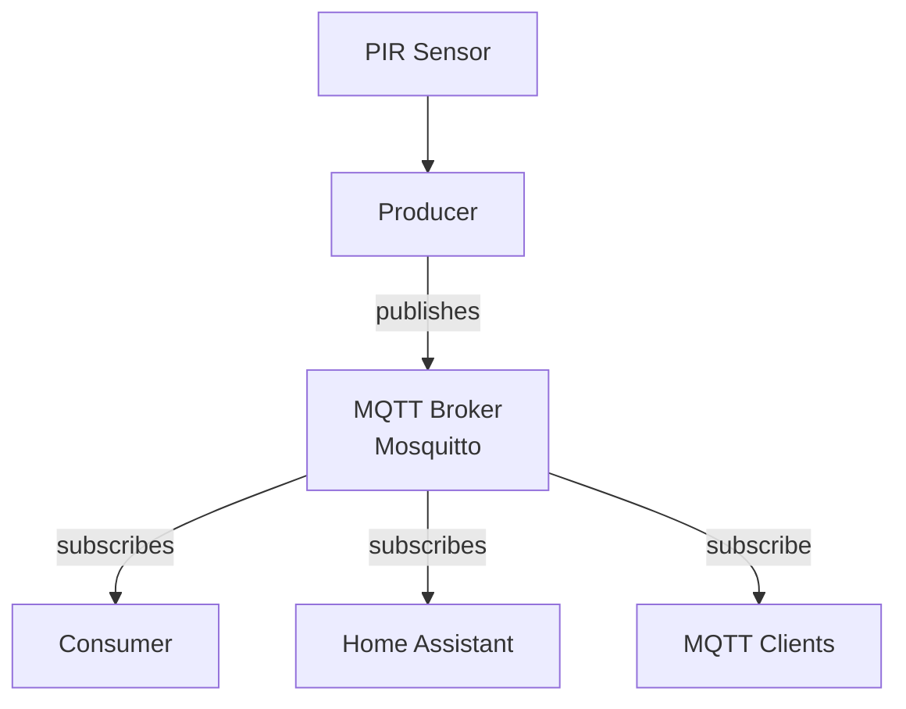
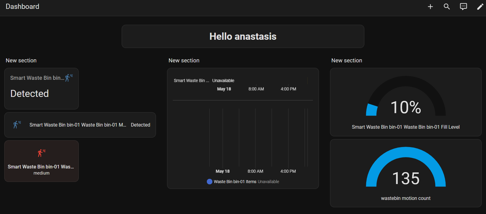

# Lab 08 — Swagger

**Student:** anastasis | 12345678

---

## Part A — Setup & Run

### Directory Structure

```
lab08/
├── README.md
├── requirements.txt
├── asyncapi.yml
├── docker-compose.yml
├── Dockerfile
├── mosquitto.conf
├── docs/
│   └── Ontology
├── models/
│   ├── context.jsonld
│   ├── environment.jsonld
│   ├── sensor.jsonld
│   └── wastebin.jsonld
└── src/
    ├── api.py
    ├── consumer.py
    ├── producer.py
    └── pirlib/
        ├── __init__.py
        ├── interpreter.py
        └── sampler.py```
``` 

### Run

**Start the MQTT broker, API, Producer and Consumer:**
```bash
docker compose up --build 
```


Open your browser and go to `http://<your-pi-ip>:5000` to access the Swagger UI.

### Verify

```bash
# List all bins
curl http://localhost:5000/bins/

# Get motion events (latest 10)
curl "http://localhost:5000/bins/urn:wastebin:bin-01/events?limit=10"

# Check known MQTT topics
curl http://localhost:5000/mqtt/topics
```
### AsyncAPI Architecture


 
### Sensor Architecture
```mermaid


                                    ┌──────────────────────┐
                               ┌───▶│  consumer (JSONL)    │
                               │    └──────────────────────┘
                               │
  PIR ──▶ producer ──▶ MQTT ───┤    ┌──────────────────────┐
                               ├───▶│  virtual sensor       │
                               │    │  (rules: usage level) │──▶ MQTT ──▶ HA
                               │    └──────────────────────┘
                               │
                               │    ┌──────────────────────┐
                               └───▶│  virtual sensor       │
                                    │  (ML: busy predictor) │──▶ MQTT ──▶ HA
                                    └──────────────────────┘
```

### Swager ui 



### AsyncSTUDIO 


### 

---

## API Design

**RQ1: Write down your complete API design, every endpoint, its HTTP method, the URI, what parameters it accepts, and what it returns. Present this as a table.**

| Method | URI | Parameters | Returns |
|--------|-----|------------|---------|
| GET | `/bins/` | — | List of all registered bins  |
| GET | `/bins/<bin_id>` | `bin_id` (path) | Single bin object or 404 |
| GET | `/bins/<bin_id>/events` | `bin_id` (path); `limit` (int, default 50) | List of motion events for that bin or 404 |
| POST | `/bins/<bin_id>/empty` | `bin_id` (path); JSON body: `emptied_by` | Created emptying record (201) or 404 |
| GET | `/bins/<bin_id>/emptied-history` | `bin_id` (path); `limit` (int, default 20) | List of emptied records for that bin |
| GET | `/sensors/` | — | List of all registered sensors (`Sensor  Objects`) |
| GET | `/sensors/<sensor_id>` | `sensor_id` (path) | Single sensor object or 404 |
| POST | `/mqtt/publish` |JSON body: topic (required), payload (required), qos (optional, int, default=1), retain (optional, bool, default=false)|Published message confirmation (200) or 400 error |
| GET | `/mqtt/topics` | — | List of known MQTT topics and their last values |
| GET | `/mqtt/topics/<topic>` | `topic` (path, supports wildcards)| Last received message for the topic or 404 error |

**RQ2: Why do the event-listing endpoints use GET and not POST?**

GET is semantically correct for read-only operations. `GET /bins/<bin_id>/events` only reads from `motion_events.jsonl` and does not modify any state. Using POST for a query would be semantically wrong. 

**RQ3: Why does the "mark as emptied" endpoint use POST and not PUT? Think about idempotency.**

PUT is expected to be idempotent as sending the same request multiple times should produce the same result as sending it once. The `POST /bins/<bin_id>/emptied` endpoint creates a new timestamped emptying record on every call. Because repeated calls produce different outcomes, the operation is inherently non-idempotent, which makes POST the correct method.

**RQ4: How did you handle the case where a client requests a bin or sensor that does not exist? What status code do you return and why?**

We call `api.abort(404, f"Bin {bin_id} not found")` same for sensors. This returns HTTP `404 Not Found` with a JSON error message. 404 is the correct status because it is a well-formed and valid request but the resource itself that does not exist. We chose not to use 400 (Bad Request) because the client did nothing wrong.

---

## Implementation

**RQ5: Where does your API read its data from? Trace the path of event data from the PIR sensor all the way to an API response.**

1.PIR Sensor → PirSampler.read() detects motion on GPIO pin 17
2.Event Record Creation → producer_loop() builds JSON-LD record with event_time, device_id, motion_state, item_count, fill_level
3.In-Process Queue → Record placed on Queue for decoupling 
4.MQTT Publish →` publisher_loop()` dequeues and publishes to smartbin/bin-01/pir-01/events 
5.MQTT Broker → Mosquitto broker delivers message to subscribers
6.Consumer persists to `motion_events.jsonl` JSONL file
API subscribes to smartbin/# and stores in-memory topic_store dict 
7.API Query → Client calls `GET /bins/<bin_id>/events?limit=10 `
8.`load_events()` reads JSONL file line-by-line.
9.API Response → Returns JSON array of Event objects

**RQ6: What query parameters does your events endpoint support? Show an example request and response.**

Parameter used `limit` which defaults to 50.

Example Request:

```bash
GET /bins/urn:wastebin:bin-01/events?limit=2
```
Example Response:

```json
[
  {
    "event_time": "2026-05-10T14:32:01.123Z",
    "device_id": "urn:dev:team08:pir-01",
    "motion_state": "detected",
    "fill_level": 42,
    "item_count": 21
  },
  {
    "event_time": "2026-05-10T14:31:45.007Z",
    "device_id": "urn:dev:team08:pir-01",
    "motion_state": "detected",
    "fill_level": 40,
    "item_count": 20
  }
]
```

**RQ7: How do the Flask-RESTx models (`api.model`) relate to the Swagger UI documentation? What happens in the UI when you add a new field to a model?**

Flask-RESTx models (lines 180-219) are Python class definitions that automatically generate OpenAPI schema documentation for Swagger UI. In Swagger UI the new field automatically appears in the Event schema definition,the field appears in the Try It Out response examples and API clients see the new field in the response schema immediately (without redeployment if doc refresh occurs).

**RQ8: Show a screenshot of your Swagger UI with endpoints visible.**


---

## MQTT Endpoints

**RQ9: Explain how the `POST /mqtt/publish` endpoint works. What does the API do when it receives a publish request?**

The endpoint validates input, publishes directly to MQTT broker via mqtt_client.publish(), and returns confirmation with the MQTT result code. The API receives an HTTP POST request with MQTT message details and publishes them directly to the MQTT broker.


**RQ10: You published a motion event through the API using `POST /mqtt/publish`. Describe the full path that message takes, from the HTTP request to the consumer's JSONL file.**

1. HTTP POST → Client sends motion event to /mqtt/publish.
2. API Validates → Checks topic, payload, QoS.
3. API Publishes → mqtt_client.publish(topic, payload) to MQTT broker.
4. MQTT Broker → Mosquitto receives and delivers to subscribers.
5. Consumer Receives → Consumer's publisher_loop subscribed to topic.
6. on_message Callback → Parses JSON payload.
7. Appends File → client.publish(args.topic, json.dumps(record)) publishes to default topic.
8. JSONL Stored → Consumer writes event to file (persisted via producer loop).

**RQ11: What does `GET /mqtt/topics` return? Why does the API need to subscribe to `smartbin/#` for this to work?**

Currently `GET /mqtt/topics` returns a hardcoded list of three known topics and their last values:
```json
{
  "topic_count": 5,
  "topics": [
    {
      "topic": "smartbin/bin-01/pir-01/events",
      "payload": "{\"event_time\": \"2026-05-10T14:32:01.123Z\", ...}",
      "qos": 1,
      "retain": false,
      "timestamp": "2026-05-10T14:32:05.456Z"
    },
    {
      "topic": "smartbin/bin-01/fill-level/state",
      "payload": "42",
      "qos": 1,
      "retain": true,
      "timestamp": "2026-05-10T14:31:50.789Z"
    }
  ]
}
```
Without subscription - The API wouldn't receive any MQTT messages, so topic_store would be empty.

**RQ12: You call `POST /bins/bin-01/emptied`. This both saves a record and publishes to MQTT. What is the advantage of combining both actions in one endpoint?**

Combining both actions in one endpoint guarantees consistency: the record is saved and the MQTT notification is sent within the same request handler. If these were two separate endpoints, a network failure or crash between the two calls could leave the system inconsistent — for example the record saved but the MQTT event never published, so Home Assistant would never update the bin's status. A single endpoint also simplifies the client: one HTTP call is all that is needed to complete the "emptied" workflow rather than orchestrating two calls in the correct order.

---

## AsyncAPI

**RQ13: What is AsyncAPI and how does it relate to OpenAPI? Why do you need both for the Smart Wastebin?**

OpenAPI documents synchronous HTTP APIs (request → response). AsyncAPI documents asynchronous, event-driven APIs such as MQTT or WebSocket channels, where messages are pushed rather than pulled. The Smart Wastebin uses both: the REST API (`api.py`) is consumed via HTTP (OpenAPI), while the sensor events travel over MQTT between `producer.py`, `consumer.py`, and Home Assistant (AsyncAPI). Without both specs, a developer would only have half the picture — they could query the API but would not know which MQTT topics exist, what the payloads look like, or who publishes and subscribes to each channel.

**RQ14: How many channels did you document in your AsyncAPI spec? For each, state who is the publisher and who is the subscriber.**

| Channel               | Topic Pattern                                             | Publisher                                             | Subscriber                            |
| --------------------- | --------------------------------------------------------- | ----------------------------------------------------- | ------------------------------------- |
| **motionEvents**      | `smartbin/{bin_id}/{sensor_id}/events`                    | Smart Wastebin Producer (Raspberry Pi sensor service) | Consumer pipeline / telemetry logger  |
| **eventsStatus**      | `smartbin/{bin_id}/{sensor_id}/events/status`             | Smart Wastebin Producer                               | Home Assistant and monitoring clients |
| **motionState**       | `smartbin/{bin_id}/{sensor_id}/motion`                    | Smart Wastebin Producer                               | Home Assistant                        |
| **fillLevelState**    | `smartbin/{bin_id}/fill-level/state`                      | Smart Wastebin Producer                               | Home Assistant                        |
| **haDiscoveryMotion** | `homeassistant/binary_sensor/{bin_id}_{sensor_id}/config` | Smart Wastebin Producer                               | Home Assistant MQTT Discovery service |
| **haDiscoveryFill**   | `homeassistant/sensor/{bin_id}_fill/config`               | Smart Wastebin Producer                               | Home Assistant MQTT Discovery service |
| **binCommand**        | `smartbin/{bin_id}/command`                               | API                                                   | Producer (to reset state)             |
| **binStatus**         | `smartbin/{bin_id}/status`                                | 	API                                                 | Home Assistant / monitoring clients   |


**RQ15: Show a screenshot of your AsyncAPI spec rendered in Swagger Editor or AsyncAPI Studio.**
  

**RQ16: Compare the `MotionEvent` message schema in your AsyncAPI spec with the `event_model` in your Flask-RESTx code. They describe the same data, what is different about the context in which each is used?**

The MotionEvent schema in AsyncAPI is used for asynchronous MQTT event messaging between publishers and subscribers in an event-driven system.

The event_model in Flask-RESTx is used for synchronous HTTP REST API communication, mainly for request validation and API documentation.

---

## Testing

**RQ17: Show the `curl` command and response for: (a) listing all bins, (b) getting events with a limit, (c) publishing an MQTT message, (d) requesting a nonexistent bin.**

**(a) Listing all bins:**
```bash
curl http://localhost:5000/bins/
```
```json
[
  {
    "id": "urn:wastebin:bin-01",
    "name": "Smart Waste Bin 01",
    "location": "Kypes",
    "status": "active"
  }
]
```

**(b) Getting events with a limit:**
```bash
curl "http://localhost:5000/bins/urn:wastebin:bin-01/events?limit=2"
```
```json
[
  {
    "event_time": "2026-05-10T14:32:01.123Z",
    "device_id": "urn:dev:team08:pir-01",
    "motion_state": "detected",
    "fill_level": 42,
    "item_count": 21
  },
  {
    "event_time": "2026-05-10T14:31:45.007Z",
    "device_id": "urn:dev:team08:pir-01",
    "motion_state": "detected",
    "fill_level": 40,
    "item_count": 20
  }
]
```

**(c) Publishing an MQTT message:**
```bash
curl -X POST http://localhost:5000/mqtt/publish \
  -H "Content-Type: application/json" \
  -d '{
    "topic": "smartbin/test/motion",
    "payload": "{\"test\": \"data\"}",
    "qos": 1,
    "retain": false
  }'
```
```json
{
  "status": "published",
  "topic": "smartbin/test/motion",
  "payload": "{\"test\": \"data\"}",
  "qos": 1,
  "retain": false,
  "mqtt_rc": 0
}
```

**(d) Requesting a nonexistent bin:**
```bash
curl http://localhost:5000/bins/urn:wastebin:bin-99
```
```json
{
  "errors": "Bin urn:wastebin:bin-99 not found"
}
```
HTTP status: `404 Not Found`

**RQ18: What is the difference between testing with Swagger UI and testing with `curl`? When would you use each?**

Swagger UI provides a visual, interactive interface in the browser so no terminal is required. It is ideal for quickly exploring and sharing. `curl` is a command-line tool that gives precise, scriptable control over every part of the request (headers, method, raw body). It is better for automated testing, reproducing exact bugs with specific headers and testing edge cases. In practice we used Swagger UI for exploratory testing during development and `curl` for regression testing and documented test cases.

---

## Reflection

**RQ19: A new team member joins your project. They need to build a mobile app that shows bin status and lets users report full bins. What do you hand them? How do the Swagger UI and AsyncAPI spec help?**

We hand them the Swagger UI URL and the AsyncAPI spec file. Swagger UI lets them browse, test, call `GET /bins/` to list bins, `GET /bins/<bin_id>/events` to fetch history with optional date filters, or `POST /bins/<bin_id>/emptied` to report a full bin. The AsyncAPI spec tells them which MQTT topics carry real-time data (`smartbin/{binId}/{sensorId}/motion`, `fill-level/state`) and what the full JSON-LD payload looks like, so if they want live push updates in the app they know exactly what to subscribe to without reading `producer.py` or `consumer.py`. Together the two specs give a complete, self-contained interface contract for both HTTP and MQTT layers.

**RQ20: In your own words, explain why the Smart Wastebin needs both a push-based system (MQTT) and a pull-based system (REST API). What would be missing if you only had one?**

MQTT is the right fit for the sensor layer: the PIR fires unpredictably, and push means `consumer.py` and Home Assistant react the moment a motion event occurs, with `pipeline_latency_ms` typically in single-digit milliseconds as measured in `consumer.py`. If we only had MQTT, a mobile app or web dashboard would need a persistent broker connection and a native MQTT client library just to read bin status — there would be no simple way to query historical events with date filters, or get a structured summary of all bins. If we only had REST, the PIR sensor would have to poll an HTTP endpoint to report its state, which is wasteful and introduces unnecessary latency; Home Assistant automations also depend on real-time MQTT state changes to trigger instantly rather than waiting for the next poll cycle. The two systems complement each other: MQTT handles real-time event flow between sensors, the consumer, and Home Assistant, while the REST API provides a clean, stateless interface for any HTTP client that needs to query, filter, and display historical data.
