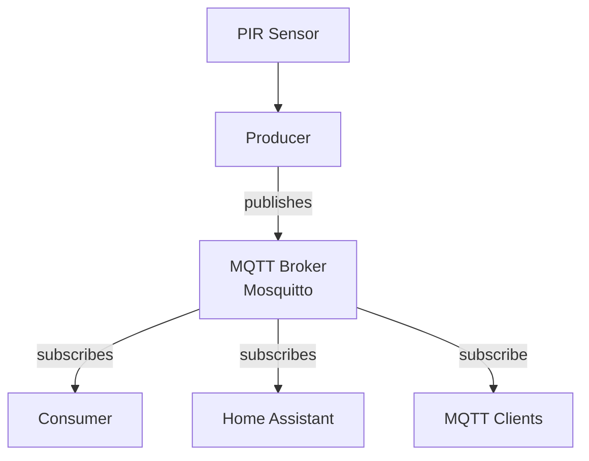

# Lab 09 — Data Processing on Edge Devices

**Student:** anastasis | 12345678

---

## Part A — Setup & Run

### Directory Structure

```
lab09/
├── README.md
├── requirements.txt
├── asyncapi.yml
├── docker-compose.yml
├── Dockerfile
├── mosquitto.conf
├── train_model.py
├── virtual_sensor_ml.py
├── virtual_sensor_rules.py
├── docs/
│   └── Ontology
├── models/
│   ├── context.jsonld
│   ├── environment.jsonld
│   ├── sensor.jsonld
│   └── wastebin.jsonld
└── src/
    ├── api.py
    ├── consumer.py
    ├── producer.py
    └── pirlib/
        ├── __init__.py
        ├── interpreter.py
        └── sampler.py```
``` 

### Run

**Start the MQTT broker, API, Producer and Consumer:**
```bash
docker compose up --build 
```


Open your browser and go to `http://<your-pi-ip>:5000` to access the Swagger UI.

### Verify

```bash
# List all bins
curl http://localhost:5000/bins/

# Get motion events (latest 10)
curl "http://localhost:5000/bins/urn:wastebin:bin-01/events?limit=10"

# Check known MQTT topics
curl http://localhost:5000/mqtt/topics
```
### AsyncAPI Architecture


 
### Sensor Architecture


                                    ┌──────────────────────┐
                               ┌───▶│  consumer (JSONL)    │
                               │    └──────────────────────┘
                               │
  PIR ──▶ producer ──▶ MQTT ───┤    ┌──────────────────────┐
                               ├───▶│  virtual sensor       │
                               │    │  (rules: usage level) │──▶ MQTT ──▶ HA
                               │    └──────────────────────┘
                               │
                               │    ┌──────────────────────┐
                               └───▶│  virtual sensor       │
                                    │  (ML: busy predictor) │──▶ MQTT ──▶ HA
                                    └──────────────────────┘

### Swager ui 


### AsyncSTUDIO 


### 

---

## Part B

**Rule-based virtual sensor**
**RQ1: What thresholds did you use for idle/low/medium/high? How did you decide on these values?**
**RQ2: What window size did you choose and why? What happens if you make it too short (e.g., 1 minute) or too long (e.g., 60 minutes)?**
**RQ3: How does the rolling window implementation (the deque) relate to what the lecture described as CEP windowed operators?**
RQ4: What would you need to change if you wanted to add a new level (e.g., “critical” for bins that might overflow)?

ML virtual sensor
RQ5: What features did you use for the classifier? Why these features?
RQ6: Show the classification report from training. What is the accuracy? Which class (busy/quiet) is harder to predict?
RQ7: Why did we use a Random Forest classifier? Could you use a different model? What would change?
RQ8: The training data is synthetic. What would change if you used real motion data collected over several weeks? What patterns might emerge that the synthetic data misses?
RQ9: The model publishes a confidence score alongside the prediction. Why is this useful? What should a consumer do if confidence is low (e.g., 55%)?

Comparison
RQ10: Give one scenario where the rule-based sensor and the ML sensor disagree. Which one would you trust more in that scenario, and why?
RQ11: The rule-based sensor reacts to the present. The ML sensor predicts the future. Give one use case where each is more useful.
RQ12: If motion patterns changed tomorrow (e.g., the bin was moved to a new location), which sensor would adapt first? What would you need to do for the other?

Architecture
RQ13: You added two new processing components to your system without modifying the producer or consumer. How did the pub/sub architecture make this possible?
RQ14: Both virtual sensors publish to MQTT. Could a third virtual sensor subscribe to their output and combine them? Give an example.
RQ15: Show a screenshot with the raw motion sensor, usage intensity, and activity prediction all visible.

Reflection
RQ16: In the DIKW pyramid, where does the raw motion event sit? Where does the usage level sit? Where does the prediction sit? What moved the data up each level?
RQ17: In your own words, what is a virtual sensor? How does it differ from a physical sensor?
RQ18: If you had access to additional sensors (temperature, fill level, noise), what virtual sensor could you build by combining them? Describe the inputs, the logic, and the output.
