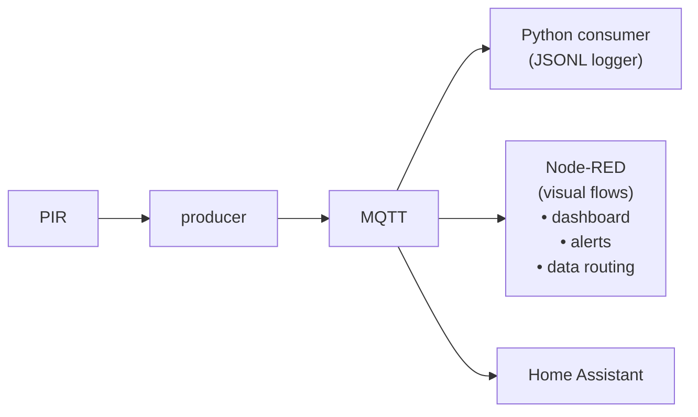

# Lab 10 — Node-RED

**Student:** anastasis | 12345678

---

## Part A — Setup & Run

### Directory Structure

```
lab10/
├── README.md
├── requirements.txt
├── asyncapi.yml
├── docker-compose.yml
├── Dockerfile
├── mosquitto.conf
├── train_model.py
├── virtual_sensor_ml.py
├── virtual_sensor_rules.py
├── docs/
│   └── Ontology
├── models_v_s/
│   └── busy_predictor.joblib
├── models/
│   ├── context.jsonld
│   ├── environment.jsonld
│   ├── sensor.jsonld
│   └── wastebin.jsonld
├── flows.json
├── screenshots/
│  
└── src/
    ├── api.py
    ├── consumer.py
    ├── producer.py
    └── pirlib/
        ├── __init__.py
        ├── interpreter.py
        └── sampler.py```
``` 
### Run

**Start the MQTT broker, API, Producer and Consumer:**
```bash
docker compose up --build 
```

### Node-RED Setup

**Install Node-RED on your Raspberry Pi**
```bash
bash <(curl -sL https://raw.githubusercontent.com/node-red/linux-installers/master/deb/update-nodejs-and-nodered)
```

**Start Node-RED**
```bash
node-red-start
```

**To view Node-RED editor visit: `http://<your-pi-ip>:1880`**

### Lab Structure


## Part B

## Getting started

**RQ1: How does Node-RED differ from writing a Python script? What is the “unit of work” in each? (In Python it is a function or a class. In Node-RED it is…?)**

Node-RED allows for non-developers to modify or add to the project without understanding Python. In other words it differs from a Python script because it is a low-code platform, which makes changes and additions possible without writing code. In Node-RED nodes are used as a "unit of work" instead of functions or classes which we can find in Python development.

**RQ2: What is the Node-RED message object? What is msg.payload and why does every node use it?**

The message object in Node-RED is a data container which helps move data through a flow. `msg.payload` is the main piece of data contained in the message object and it is used by every node as a standardization for communication between them.

**RQ3: What does the Deploy button do? Why do you need to click it after making changes?**

The deploy button stores the changes or additions that we made in Node-RED and implements them in our project. So everytime we need the changes to take place, we need to click the `Deploy` button.


---

## Building flows

**RQ4: Show a screenshot of your usage monitor flow. Label each node and explain what it does.**

**RQ5: In the counting Function node, you might have used flow.set and flow.get. What do these do? How is this similar to and different from a Python variable?**

`flow.get("motion_events")` in Node-RED retrieves a stored value while `flow.set("motion_events", value)` updates it. It is used to keep the state of a variable similar to a Python variable that is stored outside a function.

**RQ6: How does the Switch node compare to a Python if statement? What advantages does the visual version have?**

A Switch node in Node-RED works like a Python if statement as it allows for different functionality based on different values or rules that the developer implements. The visual version is easier to read, debug, and modify without digging through code.

**RQ7: You built a branching flow (count → publish + alert if high). In Python, this would be an if-else block. In Node-RED, it is visible wiring. Which is easier to understand at a glance? Which is easier to test?**

A Node-RED visible wiring while having its limitations is definitely easier to understand compared to a Python Script. It also allows for faster testing, as making changes is faster and easier, especially for non-technical people.

---

## Integration

**RQ8: Your Python consumer and your Node-RED flow both subscribe to the same MQTT topic. How is this possible? Do they interfere with each other?**

The MQTT model allows for a number of consumers to be subscribed to the same topic and for all of them to receive messages without interfering with each other.

**RQ9: You could build the usage monitor as a Python script (Lab 09) or as a Node-RED flow (this lab). Compare the two approaches: lines of code vs number of nodes, ease of modification, ease of testing, who can work with each.** 

For developers needing the maximum amount of control and modification ability a code based approach is usually the better option but for everyone else data analysts,simple users a node based approach can be quicker for ease of testing and basic modification even though the amount of nodes could be hard to work with.

**RQ10: Could Node-RED replace your Python producer (the script that reads the PIR sensor)? Why or why not?**

Node-RED would not be a good substitute for the Python Producer as a coding approach allows for a more reliable interaction with hardware because it offers more control for timing and better compatibility with sensor libraries.

---

## Node-RED in the ecosystem

**RQ11: Where does Node-RED fit in your overall system architecture? Draw or describe how it sits alongside the producer, consumer, Home Assistant, and REST API.**


**RQ12: A facilities manager (non-programmer) wants to add a new rule: “if no motion is detected for 6 hours during business hours, mark the bin as possibly blocked.” Could they build this in Node-RED without help? What nodes would they need?**

**RQ13: What are the limitations of Node-RED that the lecture mentioned? Did you encounter any of them in this lab?**

---

## Export and reproducibility

**RQ14: You exported your flows as flows.json. A teammate imports it into their Node-RED instance. What will they need to configure manually? (Hint: think about the MQTT broker connection.)**

**RQ15: Compare flows.json with a Python script in terms of version control. If two teammates edit the flow at the same time, what happens when they try to merge?**

---

## Reflection

**RQ16: After building the same logic in Python (Lab 09) and Node-RED (this lab), which did you find faster to build? Which would you trust more in production? Why?**

As we previously mentioned using Node-RED is faster especially for testing purposes. However, in a production setting in order to minimize risk and maximize control we would still go with a Python implementation.

**RQ17: The lecture argued that low-code platforms let more people contribute to the system. After this lab, do you agree? Who in your project team could use Node-RED that could not write the Python equivalent?**

We definitely agree with what the lecturer said about low-code or no-code platforms especially for non-developer employees like analysts or even the users that want a level of costumization but do not have coding knowledge.

**RQ18: If you were designing the Smart Wastebin system from scratch, which parts would you build in Python and which in Node-RED? Explain your reasoning.**

We think we would build the backbone of every part of the project in Python in order to have better costumization and control and then we would expand and implement new functions for the SmartWaste Bin using Node-RED for quicker and easier implementation.
